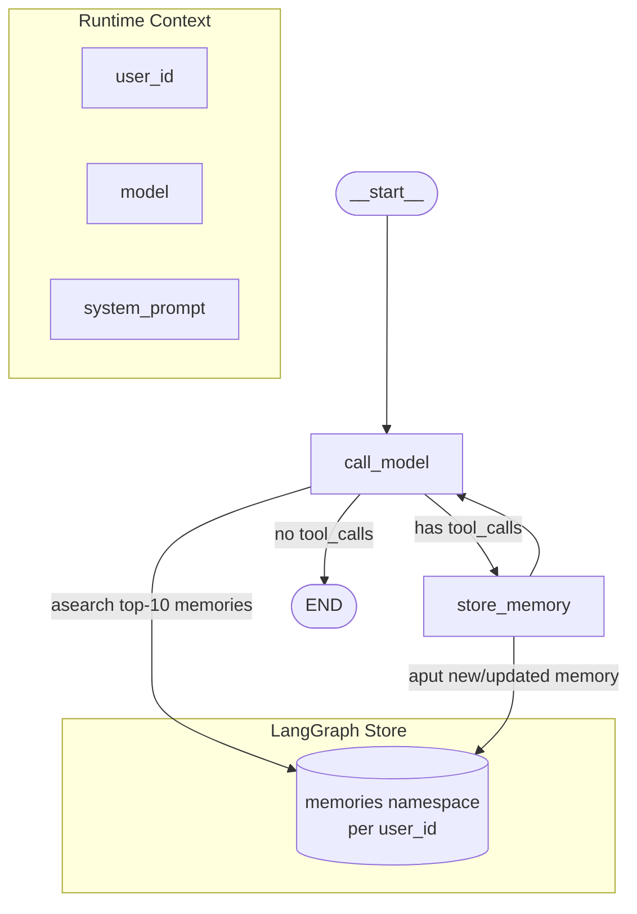

# 🧠 Memory Agent — Architecture & Code Analysis

> **Repo**: `langchain-ai/memory-agent`  
> **Stack**: Python 3.11, LangGraph ≥ 1.0, LangChain, Anthropic/OpenAI  
> **Pattern**: ReAct-style agent with persistent, user-scoped long-term memory

---

## 📁 File Structure

```
memory-agent/
├── src/memory_agent/         # Core package (7 files)
│   ├── graph.py              # LangGraph StateGraph definition (main entry)
│   ├── state.py              # Shared graph state (messages only)
│   ├── context.py            # Runtime config: user_id, model, system_prompt
│   ├── tools.py              # upsert_memory tool (the only tool)
│   ├── prompts.py            # Default SYSTEM_PROMPT template
│   ├── utils.py              # load_chat_model() helper
│   └── __init__.py
├── tests/
│   ├── unit_tests/           # test_context.py (context validation)
│   └── integration_tests/   # test_graph.py (3 conversation scenarios)
├── langgraph.json            # Deployment config (vector store dims, embed model)
├── pyproject.toml            # Dependencies, ruff, mypy config
├── .env.example              # ANTHROPIC_API_KEY / OPENAI_API_KEY
└── README.md
```

---

## 🏗️ Architecture Overview



**Flow:**
1. `call_model` — fetches top-10 semantically relevant memories → injects into system prompt → calls LLM with `upsert_memory` tool bound
2. `route_message` — if LLM called a tool → go to `store_memory`; else → `END`
3. `store_memory` — concurrently executes all `upsert_memory` calls via `asyncio.gather` → loops back to `call_model`

---

## 🔍 Module-by-Module Breakdown

### `graph.py` — Core Graph Logic
| Aspect | Detail |
|--------|--------|
| Memory retrieval | `store.asearch(("memories", user_id), query=last_3_msgs, limit=10)` |
| Model loading | Lazy — new `load_chat_model()` call **on every invocation** |
| Concurrency | `asyncio.gather` for parallel memory upserts ✅ |
| Routing | Conditional edge: tool_calls present → store, else → END |
| Loop-back | `store_memory → call_model` lets model respond after saving |

### `context.py` — Runtime Configuration
| Field | Default | Env Var Override |
|-------|---------|-----------------|
| `user_id` | `"default"` | `USER_ID` |
| `model` | `anthropic/claude-sonnet-4-5-20250929` | `MODEL` |
| `system_prompt` | `prompts.SYSTEM_PROMPT` | `SYSTEM_PROMPT` |

> ⚠️ The `__post_init__` pattern auto-reads env vars for any field still at default — clean but silent.

### `tools.py` — `upsert_memory`
- **Signature**: `content: str, context: str, memory_id?: UUID` (visible to LLM)
- **Hidden args**: `user_id`, `store` via `InjectedToolArg` — never exposed to the model
- **Upsert logic**: generates new UUID if `memory_id` is `None`, else overwrites existing key
- **Namespace**: `("memories", user_id)` — strict per-user isolation ✅

### `langgraph.json` — Deployment
```json
"store": {
  "index": { "dims": 1536, "embed": "openai:text-embedding-3-small" }
}
```
> ⚠️ **Hard dependency on OpenAI embeddings** for the vector store index even if you switch the chat model to Anthropic. Requires `OPENAI_API_KEY` regardless.

---

## ✅ Strengths

| # | Strength | Detail |
|---|----------|--------|
| 1 | **Clean separation** | state / context / tools / graph are fully decoupled |
| 2 | **Concurrent memory writes** | `asyncio.gather` handles multiple tool calls efficiently |
| 3 | **Per-user memory isolation** | Namespace `("memories", user_id)` prevents cross-user leakage |
| 4 | **Configurable at runtime** | model, user_id, system_prompt all injectable via Context |
| 5 | **Semantic memory retrieval** | Vector search over last 3 messages for relevance |
| 6 | **InjectedToolArg pattern** | Store & user_id hidden from LLM — prevents prompt injection abuse |
| 7 | **LangSmith integration** | `@ls.unit` decorator auto-syncs eval results |

---

## ⚠️ Issues & Observations

### 🔴 Critical

| Issue | Location | Impact |
|-------|----------|--------|
| **Model reloaded every call** | `graph.py:47` — `utils.load_chat_model(model)` inside `call_model` | Performance hit; no caching or reuse of the model instance |
| **OpenAI embedding required** | `langgraph.json` store config | `OPENAI_API_KEY` must always be set even for Anthropic-only setups |
| **No error handling in `store_memory`** | `graph.py:63-83` | If `aput` fails, tool call result will be malformed; no try/except |

### 🟡 Medium Priority

| Issue | Location | Detail |
|-------|----------|--------|
| **`mypy` effectively disabled** | `pyproject.toml:65` — `ignore_errors = true` | No type safety enforcement |
| **No memory deletion tool** | `tools.py` | Agent can upsert but never delete stale/wrong memories |
| **Memory limit is fixed at 10** | `graph.py:29` | Not configurable via context; could miss relevant older memories |
| **`conftest.py` is minimal** | `tests/conftest.py` | Only 3 lines; no shared fixtures for mock store/context |
| **Single tool only** | `graph.py:52` | Only `upsert_memory` is bound — no search, delete, or list tools available to the model |

### 🟢 Low Priority / Suggestions

| Suggestion | Rationale |
|------------|-----------|
| Cache `load_chat_model()` result | Avoid repeated initialization; use `functools.lru_cache` or module-level singleton |
| Add `delete_memory` tool | Lets the agent correct and prune outdated memories |
| Make `limit=10` configurable in `Context` | More flexible for different use cases |
| Enable mypy strict mode | Current `ignore_errors = true` defeats the purpose of using mypy |
| Add `user_id` validation | Currently accepts any string including empty `""` |

---

## 🧪 Testing Coverage

| Type | File | Scenarios |
|------|------|-----------|
| **Unit** | `test_context.py` | Context field validation |
| **Integration** | `test_graph.py` | 3 parametrized: short / medium / long conversations |

> Integration tests use `InMemoryStore` + `InMemorySaver` — no external deps needed ✅  
> Uses LangSmith `ls.expect()` assertions — requires `LANGSMITH_API_KEY` for CI sync

---

## 🚀 How to Run

```bash
# 1. Copy env file
cp .env.example .env
# Fill in ANTHROPIC_API_KEY (or OPENAI_API_KEY) + LANGSMITH_API_KEY

# 2. Install with uv
uv sync --dev

# 3. Run locally with LangGraph Studio
langgraph dev

# 4. Run tests
pytest tests/unit_tests/
pytest tests/integration_tests/  # requires API keys
```

---

## 🗺️ Extension Points (from README)

| What | How |
|------|-----|
| Change memory structure | Edit `upsert_memory` tool schema in `tools.py` |
| Add more tools | Pass additional tools to `llm.bind_tools([...])` in `graph.py:52` |
| Switch model | Set `MODEL=openai/gpt-4o` env var or pass via Context |
| Custom system prompt | Set `SYSTEM_PROMPT` env var or override via Context |

---

## 📊 Summary Score

| Category | Score | Notes |
|----------|-------|-------|
| Architecture clarity | 9/10 | Extremely clean 3-node graph |
| Code quality | 7/10 | No error handling in store_memory; mypy disabled |
| Test coverage | 6/10 | Good integration tests; minimal unit coverage |
| Extensibility | 8/10 | Context + tool pattern makes customization easy |
| Production readiness | 6/10 | Missing: model caching, memory deletion, error boundaries |
| **Overall** | **7.2/10** | Excellent learning template; needs hardening for production |
